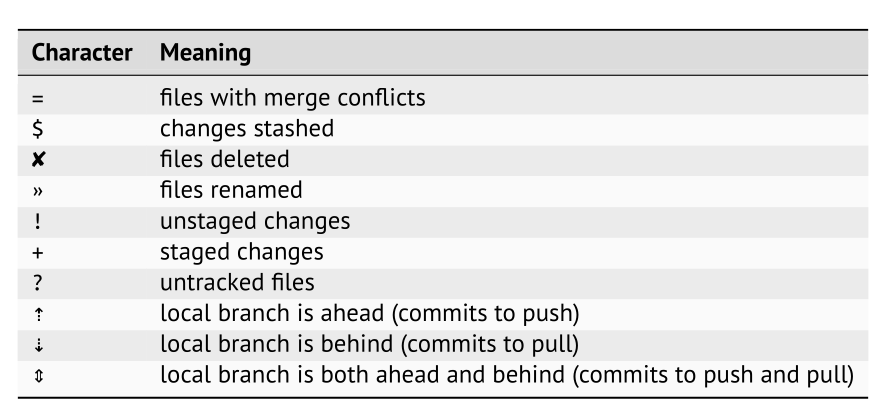

# Starship

Why [starship](https://starship.rs/)?

- It will add ==contextual information== which will ease your cognitive load
- you can use oh-my-zsh for the same purpose by <u>it can be slow</u> at times!
- Plus it is written in :crab: :tada:

> [!TIP]
>
> After installation make sure you disable oh-my-zsh them functionality by emptying this variable:
>
> `ZSH_THEME=""`

## Things to cover

- [ ] show programming language infomation
- [ ] branch info
- [ ] the current commit sha
- [ ] special states
- [ ] status summary