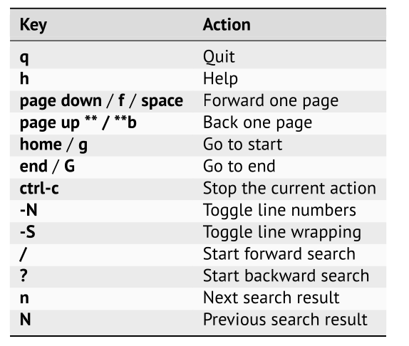

# Mastering Less: a powerful pager

**Objectives**

- Gain a solid understanding of what a pager is and how **Less** fits into the picture.
- Discover how git configures less by default
- How to tune less better :thinking:
- Review essential navigation techniques within **Less**

## Intro

More vs Less

`--More--` and `:`

## How git configures less

Less can be configured using an environmental variable, `LESS`.  Git runs less with the following configuration, `FRX`

| Option                         | Explanation                                                  |
| ------------------------------ | ------------------------------------------------------------ |
| `-F` or `--quit-if-one-screen` | If the text fits on one screen, output it all and quit. This eliminates the need for paging when the entire content can be viewed at once. |
| `-R` or `--RAW-CONTROL-CHARS`  | Allows control characters, such as colors, to be processed and displayed correctly within `less`. |
| `-X` or `--no-init`            | Skips the screen initialization process. This prevents the screen from being cleared before and after running `less`, allowing the last page of output to remain visible after `less` exits. This can be useful when you want to refer back to the output while typing your next command. |

## Tune it further

The book recommends to use the following configuration

```shell
export LESS='--chop-long-lines --HILITE-UNREAD --ignore-case \
	--incsearch --jump-target=4 --LONG-PROMPT --no-init \
	--quit-if-one-screen --RAW-CONTROL-CHARS --use-color --window=-4'
```

| Option              | Explanation                                                  |
| ------------------- | ------------------------------------------------------------ |
| `--chop-long-lines` | Truncates long lines instead of wrapping them. The portion of the line that exceeds the screen width is not displayed. |
| `--HILITE-UNREAD`   | Highlights the first unread line in the next page. This helps in identifying new content when scrolling. |
| `--ignore-case`     | Makes all searches **case-insensitive**, meaning it will match both upper and lower case letters. |
| `--incsearch`       | Enables **incremental search**, showing search matches as you type without needing to press Enter. |
| `--jump-target=4`   | Scrolls the target line to be the fourth line from the top when jumping to a search result or a specific line. |
| `--LONG-PROMPT`     | Displays a longer, more detailed prompt at the bottom, which can show more context and information. |
| `--use-color`       | Enables color display in less, which can make it easier to read files with syntax highlighting or other color-coded content. |
| `--window=-4`       | Sets the scrolling window size to 4 lines less than the terminal height, to keep some context visible. |

## Navigation :satellite:




Pager if not activate for every sub-command in git, if you want you can enable it using the following command:

```shell
git config --global pager.status true
```

