# Merge

When you have diverged branches, there are 3 options for combining branches:

- rebase
- merge
- squash

```mermaid
graph LR;
    A((❤)) --> B((★));
    B --> C((✿)):::branch1;
    B --> D((⟳)):::branch2;
    D --> E((≈)):::branch2;

    classDef branch1 fill:#ffcccc,stroke:#ff0000,stroke-width:2px;
    classDef branch2 fill:#ccccff,stroke:#0000ff,stroke-width:2px;
```

## rebase

In case you're looking for having a linear and neat history, rebase is your friend. However, rebase is generally harder to learn for newbies 😥 and harder to undo

```mermaid
graph LR;
    A((❤)) --> B((★)) --> C((✿)) --> D((⟳)) --> E((≈));
```

## merge

```mermaid
graph LR;
    A((❤)) --> B((★));
    B --> C((✿));
    B --> D((⟳));
    D --> E((≈));
    C --> F((🔶));
    E --> F((🔶));
```

Here, we have a two-way merge commit in git, the benefit is that you have access go to each individual commit in your history! However, the graph of your history is a mess 🙃.

## squash

```mermaid
graph LR;
    A((❤)) --> B((★));
    B --> C((⟳));
    B --> D((≈));
    D --> E((✿));
    C --> F((≈✿));
```

Does not matter how many commits you have, just append them together, make it easy and simple!

- easy to revert.