# Merge

When you have diverged branches, there are 3 options for combining branches:

- rebase
- merge
- squash

```mermaid
graph LR;
    A((❤)) --> B((★));
    B --> C((✿)):::branch1;
    B --> D((⟳)):::branch2;
    D --> E((≈)):::branch2;

    classDef branch1 fill:#ffcccc,stroke:#ff0000,stroke-width:2px;
    classDef branch2 fill:#ccccff,stroke:#0000ff,stroke-width:2px;
```



## rebase

If you're aiming for a linear and clean history, rebase is the ideal tool. However, it can be more challenging for beginners to learn and, in some cases, more difficult to undo.

```mermaid
graph LR;
    A((❤)) --> B((★)) --> C((✿)) --> D((⟳)) --> E((≈));
```



## merge

```mermaid
graph LR;
    A((❤)) --> B((★));
    B --> C((✿));
    B --> D((⟳));
    D --> E((≈));
    C --> F((🔶));
    E --> F((🔶));
```



Here, we have a two-way merge commit in Git. The advantage is that you retain access to each individual commit in your history. However, this can result in a cluttered and complex commit graph.

## squash

```mermaid
graph LR;
    A((❤)) --> B((★));
    B --> C((⟳));
    B --> D((≈));
    D --> E((✿));
    C --> F((≈✿));
```



No matter how many commits you have, you can squash them together, making the history cleaner and simpler to manage.

Plus, It's also easier to revert changes if needed!

## Edit all conflicts at once 🪄

```shell
git diff --name-only --diff-filter U
git diff --name-only --diff-filter U | xargs -r $(git var GIT_EDITOR)
```

```ini
[alias]
    ...
    edit-unmerged = !git diff --name-only --diff-filter U | xargs -r $(git var GIT_EDITOR)
```

```shell
git edit-unmerged
```

